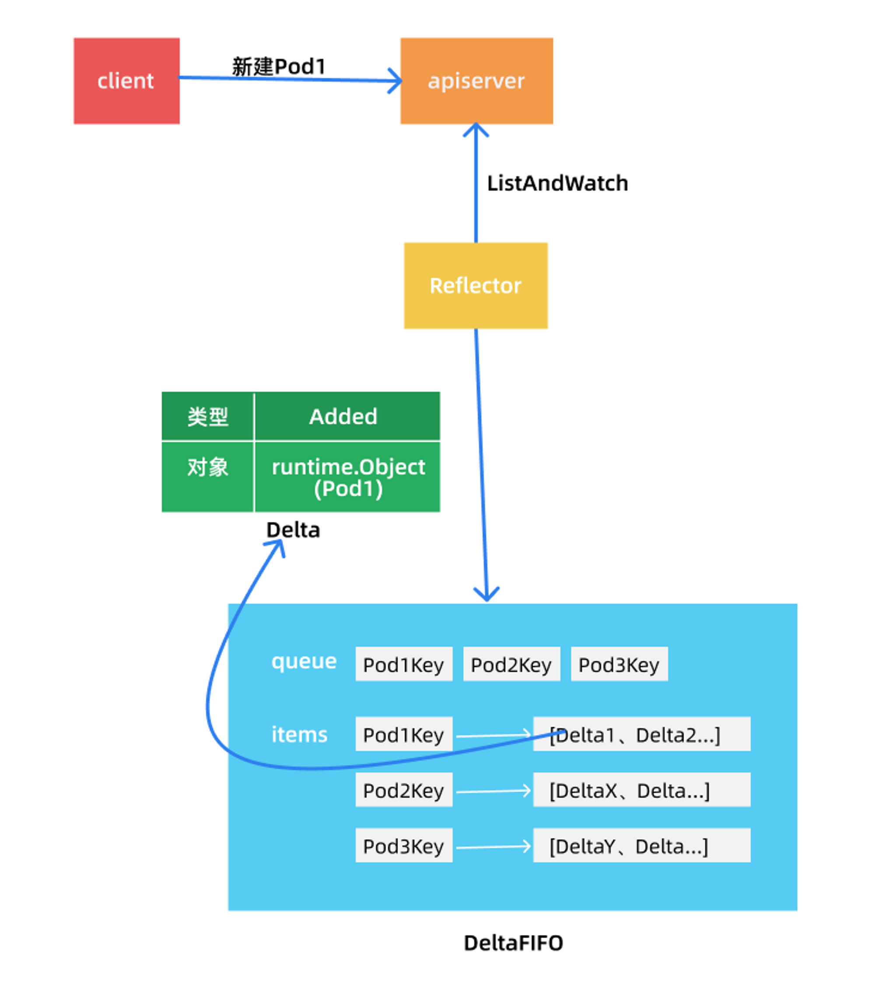

Reflector通过ListAndWatch获取到数据后传入到本地存储，也就是DeltaFIFO。DeltaFIFO是一个先进先出的队列，Delta的数据结构定义
```go
// k8s.io/client-go/tools/cache/delta_fifo.go

// DeltaType 是变化的类型（添加、删除等）
type DeltaType string

// 变化的类型定义
const (
	Added   DeltaType = "Added"     // 增加
	Updated DeltaType = "Updated"   // 更新
	Deleted DeltaType = "Deleted"   // 删除
	// 当遇到 watch 错误，不得不进行重新list时，就会触发 Replaced。
    // 我们不知道被替换的对象是否发生了变化。
    // 注意：以前版本的 DeltaFIFO 也会对 Replace 事件使用 Sync。
    // 所以只有当选项 EmitDeltaTypeReplaced 为真时才会触发 Replaced。
	Replaced DeltaType = "Replaced"
	// Sync 是针对周期性重新同步期间的合成事件
	Sync DeltaType = "Sync"          // 同步
)

// Delta 是 DeltaFIFO 存储的类型。
// 它告诉你发生了什么变化，以及变化后对象的状态。
//
// [*] 除非变化是删除操作，否则你将得到对象被删除前的最终状态。
type Delta struct {
	Type   DeltaType
	Object interface{}
}
```
Delta是Kubernetes中带有变化类型的资源对象

<div align=center>
 
</div>
如果添加了一个Pod，那么这个Delta就是带有Added类型的Pod，如果删除就是带有Deleted标签的Pod。

### FIFO
FIFO就是一个先进先出的队列，Reflector就是生产者
```go
// k8s.io/client-go/tools/cache/fifo.go

type FIFO struct {
	lock sync.RWMutex
	cond sync.Cond

  // items 中的每一个 key 也在 queue 中
	items map[string]interface{}
	queue []string

	// 如果第一批 items 被 Replace() 插入或者先调用了 Deleta/Add/Update
  // 则 populated 为 true。
	populated bool
	// 第一次调用 Replace() 时插入的 items 数
	initialPopulationCount int

  // keyFunc 用于生成排队的 item 插入和检索的 key。
	keyFunc KeyFunc

  // 标识队列已关闭，以便在队列清空时控制循环可以退出。
	closed     bool
	closedLock sync.Mutex
}

var (
	_ = Queue(&FIFO{}) // FIFO 是一个 Queue
)
```
FIFO数据结构定义了`items`和`queue`两个属性来保存队列中的数据，其中`queue`保存的是资源对象的key列表，而item是一个map类型，其key是资源对象的key保存在队列中，value是资源对象真实的数据。结构体下面有一个断言，表示当前的FIFO实现了Queue接口。
```Go
// k8s.io/client-go/tools/cache/fifo.go

// Queue 扩展了 Store  // with a collection of Store keys to "process".
// 每一次添加、更新或删除都可以将对象的key放入到该集合中。
// Queue 具有使用给定的 accumulator 来推导出相应的 key 的方法
// Queue 可以从多个 goroutine 中并发访问
// Queue 可以被关闭，之后 Pop 操作会返回一个错误
type Queue interface {
	Store

    // Pop 一直阻塞，直到至少有一个key要处理或队列被关闭，队列被关闭会返回一个错误。
    // 在前面的情况下 Pop 原子性地选择一个 key 进行处理，从 Store 中删除关联（key、accumulator）的数据,
    // 并处理 accumulator。Pop 会返回被处理的 accumulator 和处理的结果。
	
    // PopProcessFunc 函数可以返回一个 ErrRequeue{inner}，在这种情况下，Pop 将
    //（a）把那个（key，accumulator）关联作为原子处理的一部分返回到 Queue 中
    // (b) 从 Pop 返回内部错误。
	Pop(PopProcessFunc) (interface{}, error)

	// 仅当该 key 尚未与一个非空的 accumulator 相关联的时候，AddIfNotPresent 将给定的 accumulator 放入 Queue（与 accumulator 的 key 相关联的）
	AddIfNotPresent(interface{}) error
	
    // 如果第一批 keys 都已经 Popped，则 HasSynced 返回 true。
    // 如果在添加、更新、删除之前发生了第一次 Replace 操作，则第一批 keys 为 true
    // 否则为空。
	HasSynced() bool

	// 关闭该队列
	Close()
}
```
Queue拓展了Store接口，就是前面说的本地存储，在Store的基础上增加`Pop`、`AddIfNotPresent`、`HasSynced`、`Close`四个函数就变成Queue队列
```Go
// k8s.io/client-go/tools/cache/store.go

// Store 是一个通用的对象存储和处理的接口。
// Store 包含一个从字符串 keys 到 accumulators 的映射，并具有 to/from 当前
// 给定 key 关联的 accumulators 添加、更新和删除给定对象的操作。
// 一个 Store 还知道如何从给定的对象中获取 key，所以很多操作只提供对象。
//
// 在最简单的 Store 实现中，每个 accumulator 只是最后指定的对象，或者删除后为空，
// 所以 Store 只是简单的存储。
//
// Reflector 反射器知道如何 watch 一个服务并更新一个 Store 存储，这个包提供了 Store 的各种实现。
type Store interface {

	// Add 将指定对象添加到与指定对象的 key 相关的 accumulator(累加器)中。
	Add(obj interface{}) error

	// Update 与指定对象的 key 相关的 accumulator 中更新指定的对象
	Update(obj interface{}) error

	// Delete 根据指定的对象 key 删除指定的对象
	Delete(obj interface{}) error

	// List 返回当前所有非空的 accumulators 的列表
	List() []interface{}

	// ListKeys 返回当前与非空 accumulators 关联的所有 key 的列表
	ListKeys() []string

	// Get 根据指定的对象获取关联的 accumulator
	Get(obj interface{}) (item interface{}, exists bool, err error)

	// GetByKey 根据指定的对象 key 获取关联的 accumulator
	GetByKey(key string) (item interface{}, exists bool, err error)

	// Replace 会删除原来Store中的内容，并将新增的list的内容存入Store中，即完全替换数据
  // Store 拥有 list 列表的所有权，在调用此函数后，不应该引用它了。
	Replace([]interface{}, string) error

	// Resync 在 Store 中没有意义，但是在 DeltaFIFO 中有意义。
	Resync() error
}

// KeyFunc 就是从一个对象中生成一个唯一的 Key 的函数，上面的 FIFO 中就有用到
type KeyFunc func(obj interface{}) (string, error)

// MetaNamespaceKeyFunc 是默认的 KeyFunc，生成的 key 格式为：
// <namespace>/<name>
// 如果是全局的，则namespace为空，那么生成的 key 就是 <name>
// 当然要从 key 拆分出 namespace 和 name 也非常简单
func MetaNamespaceKeyFunc(obj interface{}) (string, error) {
	if key, ok := obj.(ExplicitKey); ok {
		return string(key), nil
	}
	meta, err := meta.Accessor(obj)
	if err != nil {
		return "", fmt.Errorf("object has no meta: %v", err)
	}
	if len(meta.GetNamespace()) > 0 {
		return meta.GetNamespace() + "/" + meta.GetName(), nil
	}
	return meta.GetName(), nil
}
```
FIFO添加对象的实现
```Go
// k8s.io/client-go/tools/cache/fifo.go

// Add 插入一个对象，将其放入队列中，只有当元素不在集合中时才会插入队列。
func (f *FIFO) Add(obj interface{}) error {
  // 获取对象的 key
	id, err := f.keyFunc(obj)
	if err != nil {
		return KeyError{obj, err}
	}
	f.lock.Lock()
	defer f.lock.Unlock()
	f.populated = true
    // 元素不在队列中的时候才插入队列
	if _, exists := f.items[id]; !exists {
		f.queue = append(f.queue, id)
	}
    // items 是一个 map，所以直接赋值给这个 key，这样对更新元素也同样适用
	f.items[id] = obj
	f.cond.Broadcast()
	return nil
}
```
FIFO更新对象，更新对象的实现是直接调用
```go
// k8s.io/client-go/tools/cache/fifo.go

// Update 和 Add 相同的实现
func (f *FIFO) Update(obj interface{}) error {
	return f.Add(obj)
}
```
删除Delete方法的实现，下面的方法只删除了items中的元素，会导致items中的key和queue中的数据不一致。因为从队列中弹出key，没有对象就不处理了，相当于Pop函数中实现了queue的key的删除
```go
// k8s.io/client-go/tools/cache/fifo.go

// Delete 从队列中移除一个对象。
// 不会添加到 queue 中去，这个实现是假设消费者只关心对象
// 不关心它们被创建或添加的顺序。
func (f *FIFO) Delete(obj interface{}) error {
  // 获取对象的 key
	id, err := f.keyFunc(obj)
	if err != nil {
		return KeyError{obj, err}
	}
	f.lock.Lock()
	defer f.lock.Unlock()
	f.populated = true
    // 删除 items 中 key 为 id 的元素，就是删除队列中的对象
	delete(f.items, id)
    //?为什么不直接处理 queue 这个 slice 呢？
	return err
}
```
然后是获取队列中所有对象的 List 方法的实现：
```Go
// k8s.io/client-go/tools/cache/fifo.go

// List 获取队列中的所有对象
func (f *FIFO) List() []interface{} {
	f.lock.RLock()
	defer f.lock.RUnlock()
	list := make([]interface{}, 0, len(f.items))
  // 获取所有的items的values值（items是一个Map）
	for _, item := range f.items {
		list = append(list, item)
	}
	return list
}
```
队列中元素的key的ListKeys方法实现：
```Go
 k8s.io/client-go/tools/cache/fifo.go

// ListKeys 返回现在 FIFO 队列中所有对象的 keys 列表。
func (f *FIFO) ListKeys() []string {
	f.lock.RLock()
	defer f.lock.RUnlock()
	list := make([]string, 0, len(f.items))
  // 获取所有items的key值（items是一个Map）
	for key := range f.items {
		list = append(list, key)
	}
	return 
```
根据对象或者对象key获取队列中的元素：
```Go
// k8s.io/client-go/tools/cache/fifo.go

// Get 获取指定对象在队列中的元素
func (f *FIFO) Get(obj interface{}) (item interface{}, exists bool, err error) {
	key, err := f.keyFunc(obj)
	if err != nil {
		return nil, false, KeyError{obj, err}
	}
  // 调用 GetByKey 实现
	return f.GetByKey(key)
}

// GetByKey 根据 key 获取队列中的元素
func (f *FIFO) GetByKey(key string) (item interface{}, exists bool, err error) {
	f.lock.RLock()
	defer f.lock.RUnlock()
  // 因为 items 是一个 Map，所以直接根据 key 获取即可
	item, exists = f.items[key]
	return item, exists, nil
}
```
Replace替换函数实现
```Go
// k8s.io/client-go/tools/cache/fifo.go

// Replace 将删除队列中的内容，'f' 拥有 map 的所有权，调用该函数过后，不应该再引用 map。
// 'f' 的队列也会被重置，返回时，队列将包含 map 中的元素，没有特定的顺序。
func (f *FIFO) Replace(list []interface{}, resourceVersion string) error {
	// 从 list 中提取出 key 然后和里面的元素重新进行映射
  items := make(map[string]interface{}, len(list))
	for _, item := range list {
		key, err := f.keyFunc(item)
		if err != nil {
			return KeyError{item, err}
		}
		items[key] = item
	}

	f.lock.Lock()
	defer f.lock.Unlock()

	if !f.populated {
		f.populated = true
		f.initialPopulationCount = len(items)
	}
	// 重新设置 items 和 queue 的值
	f.items = items
	f.queue = f.queue[:0]
	for id := range items {
		f.queue = append(f.queue, id)
	}
	if len(f.queue) > 0 {
		f.cond.Broadcast()
	}
	return nil
}
```
Store存储中的最后一个方法的Resync的实现：
```Go
// k8s.io/client-go/tools/cache/fifo.go

// Resync 会保证 Store 中的每个对象在 queue 中都有它的 key。
// 
// 这应该是禁止操作的，因为该属性由所有操作维护
func (f *FIFO) Resync() error {
	f.lock.Lock()
	defer f.lock.Unlock()
    // 将所有 queue 中的元素放到一个 set 中
	inQueue := sets.NewString()
	for _, id := range f.queue {
		inQueue.Insert(id)
	}
    // 然后将所有 items 中的 key 加回到 queue 中去
	for id := range f.items {
		if !inQueue.Has(id) {
			f.queue = append(f.queue, id)
		}
	}
	if len(f.queue) > 0 {
		f.cond.Broadcast()
	}
	return nil
}
```
Pop方法的实现：
```Go
// k8s.io/client-go/tools/cache/fifo.go

// Pop 会等到一个元素准备好后再进行处理，如果有多个元素准备好了，则按照它们被添加或更新的顺序返回。
//
// 在处理之前，元素会从队列（和存储）中移除，所以如果没有成功处理，应该用 AddIfNotPresent() 函数把它添加回来。
// 处理函数是在有锁的情况下调用的，所以更新其中需要和队列同步的数据结构是安全的。
func (f *FIFO) Pop(process PopProcessFunc) (interface{}, error) {
	f.lock.Lock()
	defer f.lock.Unlock()
	for {
		// 当队列为空时，Pop() 的调用会被阻塞住，直到新的元素插入队列后
		for len(f.queue) == 0 {
			if f.IsClosed() {
				return nil, ErrFIFOClosed
			}
			// 等待 condition 被广播
			f.cond.Wait()
		}
        // 取出 queue 队列中的第一个元素（key）
		id := f.queue[0]
        // 删除第一个元素
		f.queue = f.queue[1:]
		if f.initialPopulationCount > 0 {
			f.initialPopulationCount--
		}
        // 获取被弹出的元素
		item, ok := f.items[id]
		if !ok {
			// 因为 item 可能已经被删除了。
			continue
		}
        // 删除弹出的元素
		delete(f.items, id)
        // 处理弹出的元素
		err := process(item)
		if e, ok := err.(ErrRequeue); ok {
            // 如果处理没成功，需要调用 addIfNotPresent 加回队列
			f.addIfNotPresent(id, item)
			err = e.Err
		}
		return item, err
	}
}
```
AddIfNotPresent、HasSynced、Close 几个函数的实现：
```Go
// k8s.io/client-go/tools/cache/fifo.go

// AddIfNotPresent 插入一个元素，将其放入队列中。
// 如果元素已经在集合中了，则会被忽略。
//
// 这在单个的 生产者/消费者 的场景下非常有用，这样消费者可以安全地重试
// 而不需要与生产者争夺，也不需要排队等待过时的元素。
func (f *FIFO) AddIfNotPresent(obj interface{}) error {
	id, err := f.keyFunc(obj)  // 获取对象的 key
	if err != nil {
		return KeyError{obj, err}
	}
	f.lock.Lock()
	defer f.lock.Unlock()
	f.addIfNotPresent(id, obj)  // 调用 addIfNotPresent 真正的实现
	return nil
}

// addIfNotPresent 会假设已经持有 fifo 锁了，如果不存在，则将其添加到队列中去。
func (f *FIFO) addIfNotPresent(id string, obj interface{}) {
	f.populated = true
  // 存在则忽略
	if _, exists := f.items[id]; exists {
		return
	}
  // 添加到 queue 和 items 中去
	f.queue = append(f.queue, id)
	f.items[id] = obj
  // 广播 condition
	f.cond.Broadcast()
}

// 关闭队列
func (f *FIFO) Close() {
	f.closedLock.Lock()
	defer f.closedLock.Unlock()
  // 标记为关闭
	f.closed = true
	f.cond.Broadcast()
}

// 如果先调用了 Add/Update/Delete/AddIfNotPresent，或者先调用了Update，但被 Replace() 插入的第一批元素已经被弹出，则 HasSynced 返回true。
func (f *FIFO) HasSynced() bool {
	f.lock.Lock()
	defer f.lock.Unlock()
	return f.populated && f.initialPopulationCount == 0
}
```
### DeltaFIFO
DeltaFIFO和FIFO一样是一个队列，不同的地方就是DeltaFIFO中存放的是Delta，Delta是带有变化类型的资源。
```Go
// k8s.io/client-go/tools/cache/delta_fifo.go

type DeltaFIFO struct {
	// lock/cond 保护访问的 items 和 queue
	lock sync.RWMutex
	cond sync.Cond

  // 用来存储 Delta 数据 -> 对象key: Delta数组

	items map[string]Deltas
  // 用来存储资源对象的key
	queue []string

	// 通过 Replace() 接口将第一批对象放入队列，或者第一次调用增、删、改接口时标记为true
	populated bool
	// 通过 Replace() 接口（全量）将第一批对象放入队列的对象数量
	initialPopulationCount int

	// 对象键的计算函数
	keyFunc KeyFunc

	// knownObjects 列出 "known" 的键 -- 影响到 Delete()，Replace() 和 Resync()
  // knownObjects 其实就是 Indexer，里面存有已知全部的对象
	knownObjects KeyListerGetter

	// 标记 queue 被关闭了
  closed     bool
	closedLock sync.Mutex

	// emitDeltaTypeReplaced 当 Replace() 被调用的时候，是否要 emit Replaced 或者 Sync
	// DeltaType(保留向后兼容)。
	emitDeltaTypeReplaced bool
}

// KeyListerGetter 任何知道如何列出键和按键获取对象的东西
type KeyListerGetter interface {
	KeyLister
	KeyGetter
}

// 获取所有的键
type KeyLister interface {
	ListKeys() []string
}

// 根据键获取对象
type KeyGetter interface {
	GetByKey(key string) (interface{}, bool, error)
}
```
实现流程和FIFO是一样的但是在实现某些函数就有区别，对象键计算函数就不同
```Go
// k8s.io/client-go/tools/cache/delta_fifo.go

// DeltaFIFO 的对象键计算函数
func (f *DeltaFIFO) KeyOf(obj interface{}) (string, error) {
	// 用 Deltas 做一次转换，判断是否是 Delta 切片
  if d, ok := obj.(Deltas); ok {
		if len(d) == 0 {
			return "", KeyError{obj, ErrZeroLengthDeltasObject}
		}
        // 使用最新版本的对象进行计算
		obj = d.Newest().Object
	}
	if d, ok := obj.(DeletedFinalStateUnknown); ok {
		return d.Key, nil
	}
    // 具体计算还是要看初始化 DeltaFIFO 传入的 KeyFunc 函数
	return f.keyFunc(obj)
}

// Newest 返回最新的 Delta，如果没有则返回 nil。
func (d Deltas) Newest() *Delta {
	if n := len(d); n > 0 {
		return &d[n-1]
	}
	return nil
}
```
DeltaFIFO 的计算对象键的函数为什么要先做一次 Deltas 的类型转换呢？那是因为 Pop() 出去的对象很可能还要再添加进来（比如处理失败需要再放进来），此时添加的对象就是已经封装好的 Deltas 对象了。

然后同样按照上面的方式来分析 DeltaFIFO 的实现，首先查看 Store 存储部分的实现，也就是增、删、改、查功能。同样的 Add、Update 和 Delete 的实现方法基本上是一致的：
```Go
// k8s.io/client-go/tools/cache/delta_fifo.go

// Add 插入一个元素放入到队列中
func (f *DeltaFIFO) Add(obj interface{}) error {
	f.lock.Lock()
	defer f.lock.Unlock()
	f.populated = true  // 队列第一次写入操作都要设置标记
	return f.queueActionLocked(Added, obj)
}

// Update 和 Add 一样，只是是 Updated 一个 Delta
func (f *DeltaFIFO) Update(obj interface{}) error {
	f.lock.Lock()
	defer f.lock.Unlock()
	f.populated = true  // 队列第一次写入操作都要设置标记
	return f.queueActionLocked(Updated, obj)
}

// 删除和添加一样，但会产生一个删除的 Delta。如果给定的对象还不存在，它将被忽略。
// 例如，它可能已经被替换（重新list）删除了。
// 在这个方法中，`f.knownObjects` 如果不为nil，则提供（通过GetByKey）被认为已经存在的 _additional_ 对象。
func (f *DeltaFIFO) Delete(obj interface{}) error {
	id, err := f.KeyOf(obj)
	if err != nil {
		return KeyError{obj, err}
	}
	f.lock.Lock()
	defer f.lock.Unlock()
    // 队列第一次写入操作都要设置这个标记
	f.populated = true
    // 相当于没有 Indexer 的时候，就通过自己的存储对象检查下
	if f.knownObjects == nil {
		if _, exists := f.items[id]; !exists {
			// 自己的存储里面都没有，那也就不用处理了
			return nil
		}
	} else 
    // 相当于 Indexer 里面和自己的存储里面都没有这个对象，那么也就相当于不存在了，就不处理了。
    _, exists, err := f.knownObjects.GetByKey(id)
		_, itemsExist := f.items[id]
		if err == nil && !exists && !itemsExist {
			return nil
		}
	}
    // 同样调用 queueActionLocked 将数据放入队列
	return f.queueActionLocked(Deleted, obj)
}
```
最后都是调用queueActionLocked实现
```go
// k8s.io/client-go/tools/cache/delta_fifo.go

// queueActionLocked 追加到对象的 delta 列表中。
// 调用者必须先 lock。
func (f *DeltaFIFO) queueActionLocked(actionType DeltaType, obj interface{}) error {
	id, err := f.KeyOf(obj)  // 获取对象键
	if err != nil {
		return KeyError{obj, err}
	}
  
    // 将 actionType 和资源对象 obj 构造成 Delta，添加到 items 中
	newDeltas := append(f.items[id], Delta{actionType, obj})
    // 去重
	newDeltas = dedupDeltas(newDeltas)

	if len(newDeltas) > 0 {
    // 新对象的 key 不在队列中则插入 queue 队列
		if _, exists := f.items[id]; !exists {
			f.queue = append(f.queue, id)
		}
    // 重新更新 items
		f.items[id] = newDeltas
    // 通知所有的消费者解除阻塞
		f.cond.Broadcast()
	} else {
    // 这种情况不会发生，因为给定一个非空列表时，dedupDeltas 永远不会返回一个空列表。
    // 但如果真的返回了一个空列表，那么我们就需要从 map 中删除这个元素。
		delete(f.items, id)
	}
	return nil
}

// ==============排重==============
// 重新list和watch可以以任何顺序多次提供相同的更新。
// 如果最近的两个 Delta 相同，则将它们合并。
func dedupDeltas(deltas Deltas) Deltas {
	n := len(deltas)  
	if n < 2 {  // 小于两个 delta 没必要合并了
		return deltas
	}
  // Deltas是[]Delta，新的对象是追加到Slice后面
  // 所以取最后两个元素来判断是否相同
	a := &deltas[n-1]
	b := &deltas[n-2]
  // 执行去重操作
	if out := isDup(a, b); out != nil {
    // 将去重保留下来的delta追加到前面n-2个delta中去
		d := append(Deltas{}, deltas[:n-2]...)
		return append(d, *out)
	}
	return deltas
}

// 判断两个 Delta 是否是重复的
func isDup(a, b *Delta) *Delta {
  // 这个函数应该应该可以判断多种类型的重复，目前只有删除这一种能够合并
	if out := isDeletionDup(a, b); out != nil {
		return out
	}
	return nil
}

// 判断是否为删除类型的重复
func isDeletionDup(a, b *Delta) *Delta {
  // 二者类型都是删除那肯定有一个是重复的，则返回一个即可
	if b.Type != Deleted || a.Type != Deleted {
		return nil
	}
	// 更复杂的检查还是这样就够了？
	if _, ok := b.Object.(DeletedFinalStateUnknown); ok {
		return a
	}
	return b
}
```
因为系统对删除的对象`DeletedFinalStateUnknown`这个状态会存在两次删除的情况，但是两次添加同一对象由于APIServer可以保证对象的唯一性，所以没有考虑合并两次添加操作。
```Go
// k8s.io/client-go/tools/cache/delta_fifo.go

// 列举接口实现
func (f *DeltaFIFO) List() []interface{} {
	f.lock.RLock()
	defer f.lock.RUnlock()
	return f.listLocked()
}
// 真正的列举实现
func (f *DeltaFIFO) listLocked() []interface{} {
	list := make([]interface{}, 0, len(f.items))
	for _, item := range f.items {
		list = append(list, item.Newest().Object)
	}
	return list
}

// 返回现在 FIFO 中所有的对象键。
func (f *DeltaFIFO) ListKeys() []string {
	f.lock.RLock()
	defer f.lock.RUnlock()
	list := make([]string, 0, len(f.items))
	for key := range f.items {
		list = append(list, key)
	}
	return list
}

// 根据对象获取FIFO中对应的元素
func (f *DeltaFIFO) Get(obj interface{}) (item interface{}, exists bool, err error) {
	key, err := f.KeyOf(obj)
	if err != nil {
		return nil, false, KeyError{obj, err}
	}
	return f.GetByKey(key)
}

// 通过对象键获取FIFO中的元素（获取到的是 Delta 数组）
func (f *DeltaFIFO) GetByKey(key string) (item interface{}, exists bool, err error) {
	f.lock.RLock()
	defer f.lock.RUnlock()
	d, exists := f.items[key]
	if exists {
		// 复制元素的slice，这样对这个切片的操作就不会影响返回的对象了。
		d = copyDeltas(d)
	}
	return d, exists, nil
}

// copyDeltas 返回 d 的浅拷贝，也就是说它拷贝的是切片，而不是切片中的对象。
// Get/List 可以返回一个不会被后续修改影响的对象。
func copyDeltas(d Deltas) Deltas {
	d2 := make(Deltas, len(d))
	copy(d2, d)
	return d2
}

// 判断队列是否关闭了
func (f *DeltaFIFO) IsClosed() bool {
	f.closedLock.Lock()
	defer f.closedLock.Unlock()
	return f.closed
}
```
Replace的实现
```Go
// k8s.io/client-go/tools/cache/delta_fifo.go

func (f *DeltaFIFO) Replace(list []interface{}, resourceVersion string) error {
	f.lock.Lock()
	defer f.lock.Unlock()
	keys := make(sets.String, len(list))

	// keep 对老客户端的向后兼容
	action := Sync
	if f.emitDeltaTypeReplaced {
		action = Replaced
	}
  // 遍历 list
	for _, item := range list {
    // 计算对象键
		key, err := f.KeyOf(item)
		if err != nil {
			return KeyError{item, err}
		}
    // 记录处理过的对象键，使用 set 集合存储
		keys.Insert(key)
    // 重新同步一次对象
		if err := f.queueActionLocked(action, item); err != nil {
			return fmt.Errorf("couldn't enqueue object: %v", err)
		}
	}
  // 如果没有 Indexer 存储的话，自己存储的就是所有的老对象
  // 目的要看看那些老对象不在全量集合中，那么就是删除的对象了
	if f.knownObjects == nil {
		// 针对自己的列表进行删除检测。
		queuedDeletions := 0
    // 遍历所有元素
		for k, oldItem := range f.items {
      // 如果元素在输入的对象中存在就忽略了。
			if keys.Has(k) {
				continue
			}
      // 到这里证明当前的 oldItem 元素不在输入的列表中，证明对象已经被删除了
			var deletedObj interface{}
			if n := oldItem.Newest(); n != nil {
				deletedObj = n.Object
			}
			queuedDeletions++
      // 因为可能队列中已经存在 Deleted 类型的元素了，避免重复，所以采用 DeletedFinalStateUnknown 来包装下对象
			if err := f.queueActionLocked(Deleted, DeletedFinalStateUnknown{k, deletedObj}); err != nil {
				return err
			}
		}
    // 如果 populated 没有设置，说明是第一次并且还没有任何修改操作执行过
		if !f.populated {
      // 这个时候需要标记下
			f.populated = true
			// 记录第一次设置的对象数量
			f.initialPopulationCount = len(list) + queuedDeletions
		}

		return nil
	}
	
  // 检测已经删除但是没有在队列中的元素。
  // 从 Indexer 中获取所有的对象键
	knownKeys := f.knownObjects.ListKeys()
	queuedDeletions := 0
	for _, k := range knownKeys {
    // 对象存在就忽略
		if keys.Has(k) {
			continue
		}
    // 到这里同样证明当前的对象键对应的对象被删除了
    // 获取被删除的对象键对应的对象
		deletedObj, exists, err := f.knownObjects.GetByKey(k)
		if err != nil {
			deletedObj = nil
			klog.Errorf("Unexpected error %v during lookup of key %v, placing DeleteFinalStateUnknown marker without object", err, k)
		} else if !exists {
			deletedObj = nil
			klog.Infof("Key %v does not exist in known objects store, placing DeleteFinalStateUnknown marker without object", k)
		}
    // 累加删除的对象数量
		queuedDeletions++
    // 把对象删除的 Delta 放入队列，和上面一样避免重复，使用 DeletedFinalStateUnknown 包装下对象
		if err := f.queueActionLocked(Deleted, DeletedFinalStateUnknown{k, deletedObj}); err != nil {
			return err
		}
	}
  // 和上面一致
	if !f.populated {
		f.populated = true
		f.initialPopulationCount = len(list) + queuedDeletions
	}

	return nil
}
```
Replace主要用于对象的全量更新，由于DeltaFIFO对外输出的就是所有目标的增量变化，所以每次全量更新都要判断对象是否已经删除，因为在全量更新之前可能没有收到目标删除的请求。和cache不同，cache的Replace相当于重建，因为Cache就是对象全量的一种内存映射
```Go
// k8s.io/client-go/tools/cache/delta_fifo.go

func (f *DeltaFIFO) Pop(process PopProcessFunc) (interface{}, error) {
	f.lock.Lock()
	defer f.lock.Unlock()
	for {
    // 队列中是否有数据
		for len(f.queue) == 0 {
			// 如果队列关闭了这直接返回错误
			if f.IsClosed() {
				return nil, ErrFIFOClosed
			}
      // 没有数据就一直等待
			f.cond.Wait()
		}
    // 取出第一个对象键
		id := f.queue[0]
    // 更新下queue，相当于把第一个元素弹出去了
		f.queue = f.queue[1:]
    // 对象计数减一，当减到0就说明外部已经全部同步完毕了
		if f.initialPopulationCount > 0 {
			f.initialPopulationCount--
		}
    // 取出真正的对象，queue里面是对象键
		item, ok := f.items[id]
		if !ok {
			// Item 可能后来被删除了。
			continue
		}
    // 删除对象
		delete(f.items, id)
    // 调用处理对象的函数
		err := process(item)
    // 如果处理出错，那就重新入队列
		if e, ok := err.(ErrRequeue); ok {
			f.addIfNotPresent(id, item)
			err = e.Err
		}
		// 这里不需要 copyDeltas，因为我们要把所有权转移给调用者。
		return item, err
	}
}
```
其他方法的实现
```Go
// k8s.io/client-go/tools/cache/delta_fifo.go

// AddIfNotPresent 插入不存在的对象到队列中
func (f *DeltaFIFO) AddIfNotPresent(obj interface{}) error {
    // 放入的必须是 Delta 数组，就是通过 Pop 弹出的对象
	deltas, ok := obj.(Deltas)
	if !ok {
		return fmt.Errorf("object must be of type deltas, but got: %#v", obj)
	}
    // 多个 Delta 都是同一个对象，所以用最新的来获取对象键即可
	id, err := f.KeyOf(deltas.Newest().Object)
	if err != nil {
		return KeyError{obj, err}
	}
	f.lock.Lock()
	defer f.lock.Unlock()
    // 调用真正的插入实现
	f.addIfNotPresent(id, deltas)
	return nil
}

// 插入对象的真正实现
func (f *DeltaFIFO) addIfNotPresent(id string, deltas Deltas) {
	f.populated = true
  // 如果对象已经存在了，则忽略
	if _, exists := f.items[id]; exists {
		return
	}
  // 不在队列中，则插入队列
	f.queue = append(f.queue, id)
	f.items[id] = deltas
  // 通知消费者解除阻塞
	f.cond.Broadcast()
}

// Resync 重新同步，带有 Sync 类型的 Delta 对象。
func (f *DeltaFIFO) Resync() error {
	f.lock.Lock()
	defer f.lock.Unlock()
  // Indexer 为空，重新同步无意义
	if f.knownObjects == nil {
		return nil
	}
  // 获取 Indexer 中所有的对象键
	keys := f.knownObjects.ListKeys()
  // 循环对象键，为每个对象产生一个同步的 Delta
	for _, k := range keys {
		if err := f.syncKeyLocked(k); err != nil {
			return err
		}
	}
	return nil
}
// 对象同步接口的真正实现
func (f *DeltaFIFO) syncKeyLocked(key string) error {
  // 获取 Indexer 中的对象
	obj, exists, err := f.knownObjects.GetByKey(key)
	if err != nil {
		klog.Errorf("Unexpected error %v during lookup of key %v, unable to queue object for sync", err, key)
		return nil
	} else if !exists {
		klog.Infof("Key %v does not exist in known objects store, unable to queue object for sync", key)
		return nil
	}

	// 计算对象的键值，对象键不是已经传入了么？
  // 其实传入的是存在 Indexer 里面的对象键，可能与这里的计算方式不同
  id, err := f.KeyOf(obj)
	if err != nil {
		return KeyError{obj, err}
	}
  // 对象已经在存在，说明后续会通知对象的新变化，所以再加更新也没意义
	if len(f.items[id]) > 0 {
		return nil
	}
  // 添加对象同步的这个 Delta
	if err := f.queueActionLocked(Sync, obj); err != nil {
		return fmt.Errorf("couldn't queue object: %v", err)
	}
	return nil
}

// HasSynced 如果 Add/Update/Delete/AddIfNotPresent 第一次被调用则会返回 true。
// 或者通过 Replace 插入的元素都已经 Pop 完成了，则也会返回 true。
func (f *DeltaFIFO) HasSynced() bool {
	f.lock.Lock()
	defer f.lock.Unlock()
	// 同步就是全量内容已经进入 Indexer，Indexer 已经是系统中对象的全量快照了
  // 相当于就是全量对象从队列中全部弹出进入 Indexer，证明已经同步完成了
	return f.populated && f.initialPopulationCount == 0
}

// 关闭队列
func (f *DeltaFIFO) Close() {
	f.closedLock.Lock()
	defer f.closedLock.Unlock()
	f.closed = true
	f.cond.Broadcast()
}
```
判断是否同步是根据`populated`和`initialPopulationCount`两个变量来判断的，是否同步指的是第一次从ApiServer中获取全量的对象是否全部Pop，全局同步到缓存中，也就是Indexer中，因为pop一次`initialPopulationCount`就会减1，当为0的时候就表示Pop完成
### 总结
Reflector通过ListAndWatch机制首先获取全量的资源对象数据，然后调用DeltaFIFO的Replace()方法全量插入队列，然后后续通过Watch操作根据资源对象的操作类型调用DeltaFIFO的Add、Update、Delete方法，将数据更新到队列中

pop出来的元素处理方式就要看Pop的回调函数`PopProcessFunc`，在SharedInformer中，sharedInformer中Run函数中就初始化了DeltaFIFO，用于Pop回调处理的函数
```Go
// k8s.io/client-go/tools/cache/shared_informer.go

func (s *sharedIndexInformer) Run(stopCh <-chan struct{}) {
	defer utilruntime.HandleCrash()
  // 初始化 DeltaFIFO，这里就可以看出来 KnownObjects 就是一个 Indexer
	fifo := NewDeltaFIFOWithOptions(DeltaFIFOOptions{
		KnownObjects:          s.indexer,
		EmitDeltaTypeReplaced: true,
	})

	cfg := &Config{
		Queue:            fifo,
		ListerWatcher:    s.listerWatcher,
		ObjectType:       s.objectType,
		FullResyncPeriod: s.resyncCheckPeriod,
		RetryOnError:     false,
		ShouldResync:     s.processor.shouldResync,

		Process: s.HandleDeltas,  // 指定 Pop 函数的回调处理函数
	}
	......
}

// 真正的 Pop 回调处理函数
func (s *sharedIndexInformer) HandleDeltas(obj interface{}) error {
	s.blockDeltas.Lock()
	defer s.blockDeltas.Unlock()

	// from oldest to newest
	for _, d := range obj.(Deltas) {
		switch d.Type {
		case Sync, Replaced, Added, Updated:
			s.cacheMutationDetector.AddObject(d.Object)
			if old, exists, err := s.indexer.Get(d.Object); err == nil && exists {
				......
			} else {
        // 将对象添加到 Indexer 中
				if err := s.indexer.Add(d.Object); err != nil {
					return err
				}
				......
			}
		case Deleted:
      // 删除 Indexer 中的对象
			if err := s.indexer.Delete(d.Object); err != nil {
				return err
			}
			......
		}
	}
	return nil
}
```
store的类型
- cache实现store，利用threadSafeMap存放数据
- UndeltaStore：实现Store，利用cache存放数据，数据变更时通过PushFunc发送当前完整状态
- FIFO：实现Quque，利用内部的items数据结构存放数据
- Heap：实现Store，利用data数据结构存放数据，实现堆数据结构，用于优先队列
- ExpirationCache：实现Store，利用threadSafeMap存放数据

DeltaFIFO的应用场景：
- 希望处理每个对象的变化最多一次
- 当处理一个对象时，知道这个对象和上次处理时，发生了哪些变化
- 希望一个对象删除时，仍然能够处理它
- 能够周期性的重新处理所有对象

事件的生产和消费
生产
- Reflector的List
- Reflector的Watch
- Reflector的Resync

消费
- 事件派发到work queue
- 刷新本地缓存

