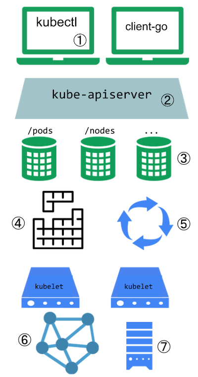
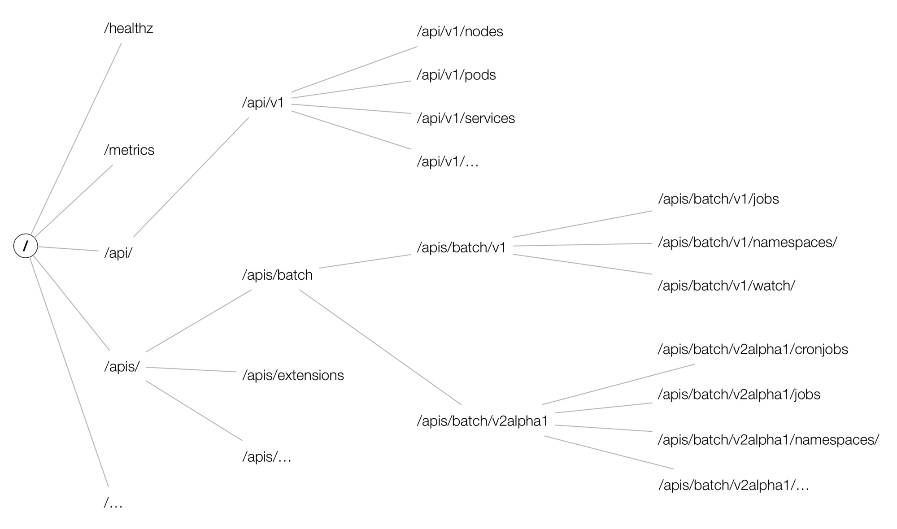
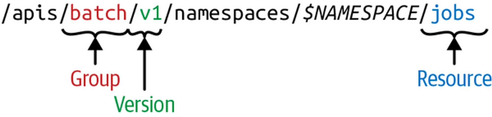
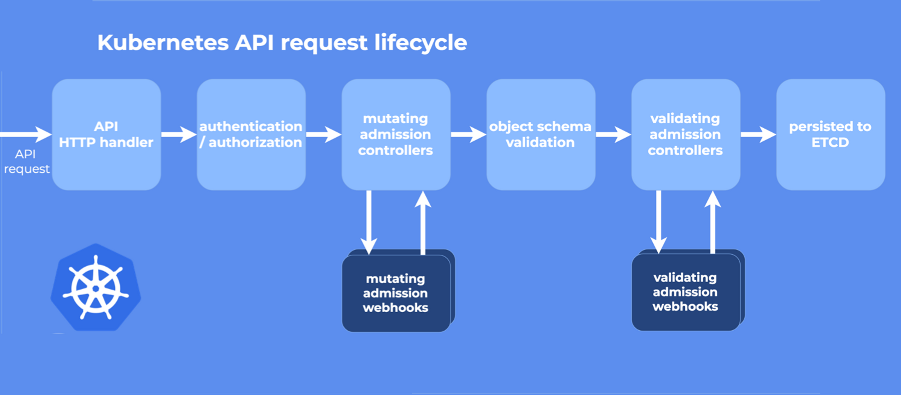

Kubernetes中最核心的的就是kube-apiserver组件，其他组件都是都是来和apiserver进行通信的，在本章中主要来了解
### Kubernetes资源介绍

- Pod：Kubernetes最小的调度单元，可以将一组密切关联的容器组合成一个逻辑单元，在单元内容器之间可以更好的共享资源
- Deployment：主要应用在无状态应用，用来部署多个Pod，管理Pod副本，在Pod出现异常时会重新创建Pod保证Pod以一定副本数稳定运行
- StatefulSet：主要用于有状态应用，可以控制Pod的启动顺序，为Pod绑定不同的存储
- Job/Cron Job：主要用来运行一次性和周期性任务
- Daemonset：通常用来部署后台常驻任务，会在每台Worker节点启动
- Service：应用的访问入口，通过Selector选择具有制定label的Pod，为服务提供服务发现和负载均衡的功能，每个Service可以通过CoreDNS获取到获取到其对应的IP
- Ingress：提供K8S外部访问应用
- PV、PVC、HostPath、EmptyDir：描述应用的各种存储

### Kubernetes的拓展点
 Kubernetes提供了丰富的拓展，来帮助用户拓展Kubernetess

<div align=center>
 
</div>

1. kubectl可以扩展插件，拓展kubectl的功能
2. API服务器处理所有的请求，API服务器中的集中拓展点能够使用户请求进行身份认证、基于其内容阻止请求、编辑请求内容等
3. API 服务器能提供各种类型的资源（Resources） 服务。
4. Kubernetes 中的调度器拓展机制
5. Kubernetes控制器
6. CNI插件
7. 设备插件


最常用的拓展点就是Kubernetes的控制器机制。控制器的含义是通过监控集群的公共状态，并致力于将当前状态变为期望状态，变更的过程由控制器实现响应的处理逻辑，一个控制器至少调谐一种资源，资源控制器负责确保当前状态Status接近期望状态Spec，不同的控制器可以协作完成一项复杂的任务。

### API对象
在Kubernetes中，对象使我们需要持久化的实体，就是最终存入etcd的数据，集群中的通过实体来表示集群的状态
#### 版本

`声明式 API`的设计，为了可扩展性，Kubernetes 在不同的 API 路径（比如`/api/v1` 或者 `/apis/batch`）下面支持了多个 API 版本，不同的 API 版本意味着不同级别的稳定性和支持：

- Alpha 级别，例如 `v1alpha1` 默认情况下是被禁用的，可以随时删除对功能的支持，所以要慎用
- Beta 级别，例如 `v2beta1` 默认情况下是启用的，表示代码已经经过了很好的测试，但是对象的语义可能会在随后的版本中以不兼容的方式更改
- 稳定级别，比如 `v1` 表示已经是稳定版本了，也会出现在后续的很多版本中。

#### API路径


 Kubernetes 集群中，一个 API 对象在 Etcd 里的完整资源路径，是由：Group（API 组）、Version（API 版本）和 Resource（API 资源类型）三个部分组成的。通过这样的结构，整个 Kubernetes 里的所有 API 对象，实际上就可以用如下的树形结构表示出来：

 <div align=center>
 
</div>

在图中可以看出，在顶层，有一个核心组和命名组和系统范围内的实体，比如 `/metrics` ，也可以使用如下命令来查看集群的API组织形式：
```
$ kubectl get --raw /
{
  "paths": [
    "/api",
    "/api/v1",
    "/apis",
    "/apis/",
    ......
    "/version"
  ]
}
``` 

也可以使用kube-proxy来开启对apiserver的访问
```
$ kubectl proxy
Starting to serve on 127.0.0.1:8001
```
开启一个新的终端，我们可以通过如下方式来访问批处理的 API 服务：
```
$ curl http://127.0.0.1:8001/apis/batch/v1
{
  "kind": "APIResourceList",
  "apiVersion": "v1",
  "groupVersion": "batch/v1",
  "resources": [
    {
      "name": "jobs",
      "singularName": "",
      "namespaced": true,
      "kind": "Job",
      "verbs": [
        "create",
        "delete",
        "deletecollection",
        "get",
        "list",
        "patch",
        "update",
        "watch"
      ],
      "categories": [
        "all"
      ],
      "storageVersionHash": "mudhfqk/qZY="
    },
    {
      "name": "jobs/status",
      "singularName": "",
      "namespaced": true,
      "kind": "Job",
      "verbs": [
        "get",
        "patch",
        "update"
      ]
    }
  ]
}
```

 <div align=center>
 
</div>

> Resource 和 Kind 的区别是什么？需要注意的 Resource 指的是 HTTP Restful API 请求路径中的资源（理解 Restful API 的资源），而 Kind 对应的是系统中真正的实体，这两个是有本质区别的。
> 

每个 Kind 都存在于一个 Group 和 Version 中 , 并通过 **GroupVersionKind (GVK)** 来标识，GVR 和 GVK 是相关联的，GVK 通过 GVR 标识的 HTTP 路径来提供服务，将 GVK 映射到 GVR 的过程就叫做 **REST mapping。**

#### API的请求流程
 <div align=center>
 
</div>

- HTTP 请求先由 `DefaultBuildHandlerChain()` 注册的一系列过滤器处理 , 这个函数位于[k8s.io/apiserver/pkg/server/config.go](https://github.com/kubernetes/kubernetes/blob/66674f549626cc41f04e475d2c0e865116c4cd40/staging/src/k8s.io/apiserver/pkg/server/config.go#L543) 文件中，它对请求进行一系列过滤操作，经过验证的就返回相应 HTTP 返回码
- 接下来根据请求的路径，通过 handler 路由到各种程序中 [k8s.io/apiserver/pkg/server/handler.go](https://github.com/kubernetes/kubernetes/blob/66674f549626cc41f04e475d2c0e865116c4cd40/staging/src/k8s.io/apiserver/pkg/server/handler.go#L42:6)
- 每个 API Group 都注册了一个 handler , 详情参见[k8s.io/apiserver/pkg/endpoints/groupversion.go](https://github.com/kubernetes/kubernetes/blob/66674f549626cc41f04e475d2c0e865116c4cd40/staging/src/k8s.io/apiserver/pkg/endpoints/groupversion.go#L99)和 [k8s.io/apiserver/pkg/endpoints/installer.go](https://github.com/kubernetes/kubernetes/blob/66674f549626cc41f04e475d2c0e865116c4cd40/staging/src/k8s.io/apiserver/pkg/endpoints/installer.go#L183) 它接受 HTTP 请求和上下文，并从 etcd 中检索和传递请求的对象进行数据处理。