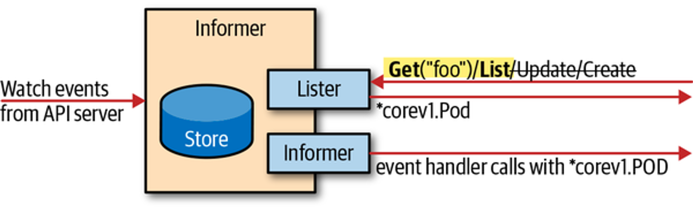

### 介绍
通过Clientset可以操作所有的原生资源，如果我们需要一直获取集群对象，就不断通过List操作去获取肯定是不合理的，因为如果数据没有变化，每次都去请求服务端，会给服务端带来巨大的压力。所以实际上，我们可以使用Watch操作来监听数据的变化，然后根据业务逻辑去处理变化的数据
```Go
// staging/src/k8s.io/apimachinery/pkg/watch/watch.go
// Interface 可以被任何知道如何 watch 和通知变化的对象实现
type Interface interface {
	// Stops watching. Will close the channel returned by ResultChan(). Releases
	// any resources used by the watch.
	Stop()

	// Returns a chan which will receive all the events. If an error occurs
	// or Stop() is called, this channel will be closed, in which case the
	// watch should be completely cleaned up.
	ResultChan() <-chan Event
}
```
Watch接口的ResultChan方法可以返回以下几种事件
```Go
// staging/src/k8s.io/apimachinery/pkg/watch/watch.go
// EventType 定义可能的事件类型
type EventType string

const (
	Added    EventType = "ADDED"
	Modified EventType = "MODIFIED"
	Deleted  EventType = "DELETED"
	Bookmark EventType = "BOOKMARK"
	Error    EventType = "ERROR"

	DefaultChanSize int32 = 100
)

// Event represents a single event to a watched resource.
// +k8s:deepcopy-gen=true
type Event struct {
	Type EventType

	// Object is:
	//  * If Type is Added or Modified: the new state of the object.
	//  * If Type is Deleted: the state of the object immediately before deletion.
	//  * If Type is Bookmark: the object (instance of a type being watched) where
	//    only ResourceVersion field is set. On successful restart of watch from a
	//    bookmark resourceVersion, client is guaranteed to not get repeat event
	//    nor miss any events.
	//  * If Type is Error: *api.Status is recommended; other types may make sense
	//    depending on context.
	Object runtime.Object
}
```
在实际中不建议直接使用Watch接口，因为集群中的资源比较多，需要自己在客户端中维护一套缓存，维护成本比较大。所以在client-go中提供了Informer机制，Informers是这个事件接口和带索引查找功能的内存缓存集合。Informers第一次被调用时候会先List全量对象数据缓存在本地，然后通过Watch机制来更新缓存
### 运行原理
<div align=center>
 
</div>

Informer的基本处理流程：
- 以Event事件的方式从ApiServer中获取数据
- 提供Lister接口，从内存缓存中get和list数据
- 为添加、删除、更新注册事件处理器

Informers也有错误处理方式，当运行的watch的连接中断时，会尝试使用另一个watch请求来恢复连接，在不丢失任何事件情况下恢复事件流，如果中断时间过长，而且ApiServer丢失了事件。那么Informer就会重新List全量数据。而在重新List全量操作的时候，还可以配置一个重新同步参数，用于协调内存数据和业务逻辑的数据一致性，每次过了该周期，注册的事件处理程序就将被所有的对象调用，周期参数通常以氛围单位，重新同步是纯内存操作，不会触发对服务器的调用

共享Informer工厂允许我们在应用中为同一个资源共享Informer，也就是不同的控制器可以使用相同watch连接到后台的APIServer，例如Kube-controller-manager中的控制器的数量就非常多，但是对于每个资源，进程中只有一个Informer
### 代码
```Go
package main

import (
	"fmt"
	"k8s.io/apimachinery/pkg/labels"
	"k8s.io/client-go/informers"
	"k8s.io/client-go/kubernetes"
	"k8s.io/client-go/tools/cache"
	"k8s.io/client-go/tools/clientcmd"
	"time"
)

func main()  {
	config, err := clientcmd.BuildConfigFromFlags("", clientcmd.RecommendedHomeFile)
	if err !=nil{
		panic(err)
		return
	}
	// 创建Clientset对象
	clientset, err := kubernetes.NewForConfig(config)
	if err != nil {
		panic(err)
		return
	}
	informerFactory := informers.NewSharedInformerFactory(clientset, 30*time.Second)
	deploymentsInformer := informerFactory.Apps().V1().Deployments()
	informer := deploymentsInformer.Informer()
	lister := deploymentsInformer.Lister()

	informer.AddEventHandler(cache.ResourceEventHandlerFuncs{
		AddFunc  :  func(obj interface{}){},
		UpdateFunc: func(oldObj, newObj interface{}){},
		DeleteFunc :func(obj interface{}){},
	})
	stopChan := make(chan struct{})
	defer close(stopChan)

	// 启动所有的Informer List & watch
	informerFactory.Start(stopChan)
	// 等待所有的Informer的缓存被同步
	informerFactory.WaitForCacheSync(stopChan)

	deployments, err := lister.Deployments("kube-system").List(labels.Everything())
	if err != nil {
		panic(err)
		return
	}
	for _,deployment := range deployments {
		fmt.Println(deployment.Name)
	}
}
```